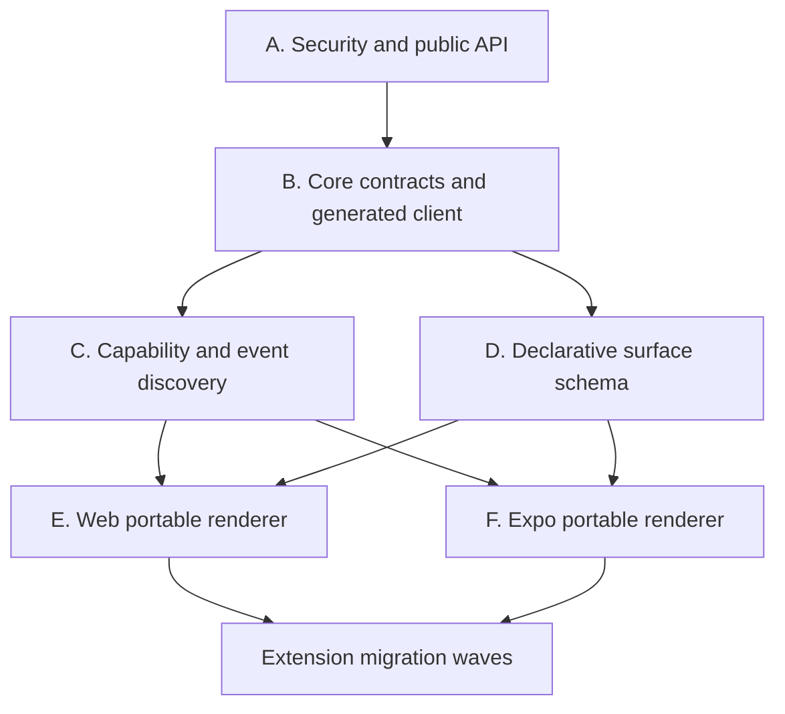

# Extension portability migration plan

Status: proposed execution plan

Related architecture: [Repository architecture, extension authoring, and mobile direction](repository-architecture-and-extension-guide.md)

## 1. Goal

Move every VertexADE extension to a server-first, cross-client model where:

- provider credentials and vendor execution stay on the server;
- extension data and actions use versioned, typed public contracts;
- web and Expo can render common extension experiences;
- existing web micro-frontends continue working during migration;
- a server-installed extension is useful on mobile without requiring a new app binary;
- custom React Native code is optional and reserved for experiences that cannot be expressed declaratively.

The migration is complete when an enabled extension can expose its health, resources, data, and allowed actions consistently to web and mobile, while disabled extensions disappear from both clients and reject operational execution.

## 2. Target extension model

Every extension can support one or more portability levels.

| Level          | Contract                                                               | Client behavior                                              | Requires app release |
| -------------- | ---------------------------------------------------------------------- | ------------------------------------------------------------ | -------------------- |
| 1. Headless    | Providers, capabilities, resources, search, inbox, events              | Host renders generic catalog, health, resources, and actions | No                   |
| 2. Declarative | Versioned collection, detail, form, filter, status, and action schemas | Web and Expo render with their own component kits            | No                   |
| 3. Rich native | Separate React Native entrypoint using the scoped client               | Expo mounts extension-specific native UI                     | Yes                  |

Level 1 is required for all extensions. Level 2 is required for extensions with an operator workspace. Level 3 is optional and should be added only after a real product need cannot be met safely with Level 2.

### 2.1 Desired package anatomy

```text
packages/extensions/<id>/
├── assets/
│   └── icon.svg
├── src/
│   ├── shared/
│   │   ├── contract.ts       JSON-safe request/response schemas
│   │   ├── entities.ts       normalized entity types
│   │   └── surfaces.ts       declarative surface definitions
│   ├── server/
│   │   ├── client.ts         vendor client; secrets stay here
│   │   ├── capabilities.ts   typed queries/actions
│   │   ├── routes.ts         extension-specific HTTP compatibility
│   │   └── extension.ts      manifest and registrations
│   ├── web/
│   │   ├── module.tsx        existing or rich web workspace
│   │   └── settings-module.tsx
│   └── native/
│       └── module.tsx        optional, compile-time native surface
├── package.json
├── tsconfig.json
├── tsconfig.web.json
└── tsconfig.native.json      only when Level 3 exists
```

`shared` must be JSON-safe and import neither Node, DOM, React DOM, nor React Native APIs. Web and native code may depend on `shared`; server code may depend on `shared`; `shared` must never depend on either host.

## 3. Migration principles

### 3.1 No flag-day platform API change

Add portable contracts as optional, feature-gated additions while platform API `1` remains supported. Existing manifests and web micro-frontends continue to load.

Introduce explicit platform features such as:

```ts
portable - capability - contracts
declarative - extension - surfaces
versioned - platform - client
resumable - platform - events
```

Increase the platform API version only after:

- the compatibility adapters are proven;
- all bundled extensions pass conformance;
- web uses the public client for migrated paths;
- the Expo client has completed at least one real vertical slice;
- a documented upgrade path exists for trusted local extensions.

### 3.2 Migrate contracts before screens

For each extension:

1. inventory current server routes, providers, capabilities, settings, secrets, and web behavior;
2. define normalized entities and JSON schemas;
3. expose read operations as queries and side effects as actions;
4. attach authorization, confirmation, and idempotency metadata;
5. declare portable surfaces;
6. render those surfaces in web;
7. render the same contract in Expo;
8. retire only the duplicated client-specific data path.

Do not port a 2,000-line web board directly to React Native.

### 3.3 One behavior owner

- Providers own vendor semantics.
- Capabilities own executable operations.
- Work owns durable engineering outcomes.
- Surface declarations own portable presentation semantics.
- Web and native renderers own platform-specific interaction and accessibility.
- The public API owns authentication, authorization, versioning, and audit.

### 3.4 Preserve rich web experiences

Declarative surfaces do not need to replace every existing web workspace immediately. A migrated extension may retain its rich web frontend while:

- both web paths consume the same normalized contract;
- Expo uses the declarative path;
- parity is measured before any web replacement;
- legacy extension routes remain as compatibility adapters.

### 3.5 Native code is a release-time dependency

Server discovery cannot dynamically install React Native code into an already shipped app. Level 3 modules must be bundled into an app build and covered by its runtime compatibility policy.

All non-bundled extensions must still provide Level 1 behavior. Extensions needing a mobile workspace should provide Level 2 behavior so they remain available without a new binary.

## 4. Required platform workstreams

The extension waves depend on six shared workstreams.



### Workstream A — security and public API

Purpose: make extension data and execution safe for non-local clients.

Deliverables:

- `/api/v1` namespace;
- authenticated user/device sessions;
- authorization scopes for reads, launches, actions, upstream mutations, settings, and administration;
- audited privileged mutations;
- allowlisted browser origins;
- idempotency keys;
- stable error envelope;
- pagination and filtering rules;
- API compatibility policy.

Minimum scopes:

```text
catalog:read
work:read
work:write
runs:read
runs:control
extensions:read
extensions:execute
extensions:configure
scm:mutate
admin:extensions
admin:system
```

Exit gate:

- an authenticated test client can list modules;
- an unauthorized client cannot read extension data;
- a read-only user cannot execute an action;
- a privileged action records actor, target, result, and idempotency key.

### Workstream B — core contracts and generated client

Purpose: give web, Expo, and extensions one transport contract.

Deliverables:

- runtime-neutral core contract package;
- server contract package;
- web-only frontend contract package;
- native frontend contract package;
- OpenAPI or equivalent generated public schema;
- `@vertexade/platform-client`;
- extension-scoped client;
- compatibility exports from `@vertexade/platform-contracts`.

Recommended first split:

```text
@vertexade/platform-core-contracts
@vertexade/platform-server-contracts
@vertexade/platform-web-contracts
@vertexade/platform-native-contracts
@vertexade/platform-client
```

Exit gate:

- core contracts typecheck without DOM or Node libraries;
- web consumes the generated client for module catalog and capability execution;
- API and client contract drift fails CI.

### Workstream C — capability and event discovery

Purpose: make enabled extension behavior inspectable and executable by any host.

Deliverables:

- public capability catalog;
- safe input/output schemas;
- action confirmation metadata;
- entity and placement metadata;
- durable execution status;
- versioned event envelope;
- replay cursor or `Last-Event-ID`;
- module and capability revision fields.

Exit gate:

- a generic client can discover, render, execute, and follow one extension action without importing extension code;
- reconnecting from an event cursor produces no missing or duplicate visible state.

### Workstream D — declarative surface schema

Purpose: represent common extension workspaces without client-specific code.

Initial primitives:

- collection;
- detail;
- section;
- field;
- badge/status;
- search;
- filter;
- sort;
- form;
- empty/loading/error state;
- command;
- contextual action;
- pagination;
- navigation target.

Keep the first version deliberately small. Do not include arbitrary HTML, JavaScript expressions, CSS, remote component names, or direct URLs for credentialed vendor calls.

Example shape:

```ts
type ExtensionSurface = {
  id: string
  version: 1
  kind: 'collection' | 'detail' | 'form'
  title: string
  source: {
    capabilityId: string
    input?: Record<string, JsonValue>
  }
  fields?: SurfaceField[]
  filters?: SurfaceFilter[]
  actions?: string[]
  navigation?: SurfaceNavigation
}
```

Exit gate:

- schema validation rejects unknown executable content and unsafe destinations;
- a fixture collection renders equivalently in web and native reference renderers;
- accessibility labels, loading, empty, error, and destructive confirmation states are contract-tested.

### Workstream E — web portable renderer

Purpose: prove the declarative contract without waiting for mobile.

Deliverables:

- renderer in a new web-focused extension package;
- design-system mapping;
- query/mutation state;
- generic action forms;
- confirmation handling;
- module-aware errors;
- route and deep-link integration;
- feature flag allowing legacy and portable surfaces side by side.

Exit gate:

- migrated extension read data is equal between legacy and portable paths;
- actions produce the same durable execution result;
- disabling the extension removes both paths;
- keyboard, screen-reader, responsive, and error-state checks pass.

### Workstream F — Expo portable renderer

Purpose: consume the same extension contract on native platforms.

Deliverables:

- Expo app shell;
- authenticated platform client;
- native design tokens and primitives;
- collection/detail/form renderer;
- action and confirmation flow;
- event resume;
- push-to-deep-link routing;
- offline read cache;
- module compatibility screen.

Exit gate:

- the pilot extension works on physical iOS and Android devices;
- no vendor secret is present in device storage, logs, or network responses;
- a background completion notification opens authoritative server state.

## 5. Compatibility bridge

The bridge prevents regressions while old and new clients coexist.

### 5.1 Manifest additions

Add optional fields rather than replacing `frontend` or `settings`:

```ts
type ModuleManifest = {
  // existing fields
  portable?: {
    contractVersion: 1
    surfaces?: PortableSurfaceDeclaration[]
    minimumClientFeatures?: string[]
  }
  native?: {
    entry: string
    expose: string
    runtime?: string
  }
}
```

The final names require an ADR. The essential behavior is:

- absent `portable`: current behavior;
- present `portable`: generic hosts may render declared surfaces;
- present `frontend`: existing web host may still mount the micro-frontend;
- present `native`: Expo may use a bundled rich module when compatible;
- incompatible native module: fall back to the portable surface.

### 5.2 Route adapters

Existing `/api/extensions/:moduleId/*` endpoints remain during migration.

For migrated operations:

- new client uses `/api/v1`;
- compatibility route calls the same application service or capability;
- no duplicated vendor client or business rule;
- response comparison tests protect parity;
- deprecation begins only after web no longer uses the route.

### 5.3 Dual rendering

Each migrated extension gets a temporary feature switch:

```text
extension_surface.<module-id> = legacy | portable | compare
```

- `legacy`: current web module;
- `portable`: new renderer;
- `compare`: legacy visible, portable result evaluated in development/test for shape parity.

Remove the switch only after parity and rollback criteria pass.

### 5.4 Version negotiation

The catalog response should publish:

- platform API version;
- public API version;
- supported client features;
- portable surface schema versions;
- module contract version;
- optional minimum client version.

Clients must hide unsupported surfaces and explain incompatibility without disabling otherwise usable headless capabilities.

## 6. Extension migration order

### 6.1 Wave summary

| Wave                  | Extensions                                            | Purpose                                                |
| --------------------- | ----------------------------------------------------- | ------------------------------------------------------ |
| Pilot                 | Sentry, constrained GitHub action slice               | Prove read-heavy workspace and privileged action       |
| Findings              | SonarQube, CodeRabbit                                 | Reuse one normalized findings family                   |
| Planning              | Linear, Azure DevOps                                  | Prove common planning entities and richer workflows    |
| Records               | Airtable                                              | Prove dynamic schemas and user-configured presentation |
| Agents and operations | Codex, Claude Code, OpenCode, ACP, Container previews | Prove generic runtime/status/control                   |
| Optional native       | Only extensions with accepted declarative gaps        | Add rich native code deliberately                      |

GitHub's complete SCM behavior is not migrated in one unit. The pilot uses a narrow, highly audited action slice; the remaining read and action surfaces move incrementally.

### 6.2 Extension target matrix

| Extension          | Current strengths                                     | Target level | Wave                | Effort | Rich native initially |
| ------------------ | ----------------------------------------------------- | -----------: | ------------------- | ------ | --------------------- |
| Sentry             | findings provider, details, inbox/search, remediation |            2 | Pilot               | M      | No                    |
| GitHub             | SCM/deployment providers, contextual review actions   |          1–2 | Pilot + incremental | L      | No                    |
| SonarQube          | findings provider, inbox/search, remediation          |            2 | Findings            | M      | No                    |
| CodeRabbit         | findings, work references, inbox/search, re-review    |            2 | Findings            | M      | No                    |
| Linear             | work management, references, issue workspace          |            2 | Planning            | M–L    | No                    |
| Azure DevOps       | planning, work items, sprints, task launch            |            2 | Planning            | XL     | No                    |
| Airtable           | records, dynamic fields, configurable board           |            2 | Records             | L      | No                    |
| Codex              | agent runtime, timeline, steering                     |            1 | Agents              | S–M    | No                    |
| Claude Code        | agent runtime and environment                         |            1 | Agents              | S      | No                    |
| OpenCode           | agent runtime, reconciliation, skills                 |            1 | Agents              | S–M    | No                    |
| ACP                | dynamic harness-backed agents and policies            |            1 | Agents              | M      | No                    |
| Container previews | preview lifecycle routes                              |          1–2 | Operations          | M      | No                    |

Effort is relative and excludes the shared platform workstreams.

## 7. Pilot wave

### 7.1 Sentry pilot

Why first:

- already has a normalized findings provider;
- list/detail/filter/remediation maps cleanly to declarative primitives;
- secrets already stay in server settings;
- existing web module provides a parity reference;
- action outcome can be observed as durable Work.

#### Sentry work packages

**SEN-1 — Contract inventory**

- document current config, route, provider, cache, inbox, search, details, and remediation behavior;
- record real response fixtures with secrets removed;
- identify every field displayed by the current web module.

Acceptance:

- every current user-visible field and action maps to a contract item or an explicit deferred item.

**SEN-2 — Shared findings contract**

- add JSON-safe `FindingSummary`, `FindingDetail`, `FindingFilter`, and pagination schemas;
- remove UI-only assumptions;
- retain provider-specific metadata in a bounded namespaced object.

Acceptance:

- fixtures validate;
- malformed upstream data fails at the server boundary;
- shared code has no Node or DOM import.

**SEN-3 — Query and action capabilities**

- expose list and detail queries;
- expose remediation as an idempotent action;
- attach repository selection and confirmation metadata;
- return durable Work/execution identity.

Acceptance:

- capability history contains module, actor, input hash, result, and Work link;
- read-only users cannot remediate.

**SEN-4 — Declarative surfaces**

- collection with search and multi-select filters;
- detail sections;
- source link;
- remediation action;
- loading, empty, degraded, and provider-error states.

Acceptance:

- surface validator passes;
- unsupported fields do not silently disappear;
- source links are safe and explicit.

**SEN-5 — Web parity**

- render Sentry through the portable web renderer behind the feature switch;
- compare list count, filters, detail content, and remediation result;
- retain legacy web module for rollback.

Acceptance:

- approved visual and behavioral parity;
- no extra provider requests from duplicate loading;
- extension disable and cache invalidation behave identically.

**SEN-6 — Native proof**

- render the same surfaces in Expo;
- execute remediation;
- follow Work/run state;
- handle background completion through push and deep link.

Acceptance:

- physical iOS and Android evidence;
- no Sentry credential or raw authorization header reaches the device.

### 7.2 GitHub action pilot

Purpose: prove authorization, confirmation, idempotency, stale-head protection, and audit for an upstream mutation.

Start with one action, recommended:

```text
github.comment-review
```

It is lower risk than approval or auto-merge but still proves authenticated upstream mutation and PR-head context.

Work packages:

- publish the PR reference schema;
- expose the action through `/api/v1`;
- require exact repository, PR number, and expected head SHA;
- require comment confirmation;
- record actor and delivery result;
- render from the same contextual action on web and Expo;
- add replay-safe idempotency behavior.

Acceptance:

- stale head is rejected;
- duplicate submission with the same idempotency key does not post twice;
- user without `scm:mutate` cannot execute;
- web and mobile show the same delivery state.

Approval and auto-merge remain disabled on mobile until this pilot passes security review and production observation.

## 8. Findings wave

Create one reusable findings surface family after the Sentry pilot.

### 8.1 Shared findings family

Own in platform extension UI schema:

- common summary/detail fields;
- severity and status presentation;
- project/repository/source facets;
- pagination;
- evidence sections;
- source navigation;
- remediation contextual action;
- bulk selection rules.

Providers may add namespaced optional fields, but the host must not branch on module id.

### 8.2 SonarQube

Migration:

- map issue and rule metadata into the shared findings contract;
- keep authenticated Web API calls server-side;
- expose list/detail/remediation through typed capabilities;
- declare shared findings surfaces;
- compare against current web module;
- enable Expo after web parity.

Specific gates:

- project filtering remains multi-select where supported;
- code locations are safe structured data, not trusted HTML;
- remediation prompt includes bounded, explicitly untrusted finding content;
- no upstream issue mutation is added implicitly.

### 8.3 CodeRabbit

Migration:

- map unresolved review threads into findings;
- preserve PR, thread, path, line, and current-head identity;
- expose re-review as a separate action from remediation launch;
- retain work-reference, inbox, and search contributions;
- declare shared findings surfaces.

Specific gates:

- resolved/stale review threads cannot be acted on as current;
- re-review requires upstream mutation authorization;
- remediation and re-review have distinct confirmations and audit events;
- external review content remains untrusted.

Wave exit:

- Sentry, SonarQube, and CodeRabbit share one renderer with no host-side module-id conditionals;
- each retains provider-specific detail through schema extensions;
- all three work on web and Expo from the same contracts.

## 9. Planning wave

### 9.1 Shared planning contract

Define normalized:

- team/project;
- iteration/cycle;
- work item/issue;
- parent/child relation;
- assignee;
- status;
- priority;
- labels/tags;
- source URL;
- create/update/launch actions.

Do not force Azure DevOps hierarchy onto Linear or vice versa. Optional relations and provider-owned presentation labels remain part of the provider contract.

### 9.2 Linear

Migrate Linear first because its current workspace is smaller and provides a cleaner proof of the planning contract.

Work packages:

- shared issue schemas;
- list/detail/search queries;
- work-reference mapping;
- create/update/launch actions where currently supported;
- declarative collection/detail/form surfaces;
- web parity;
- Expo rendering.

Gates:

- team scoping is enforced server-side;
- issue identifiers remain provider-owned;
- actions return updated revision or a durable execution;
- Work launch preserves source identity and deep link.

### 9.3 Azure DevOps

Azure is a decomposition project, not a direct screen port.

Work packages:

**AZD-1 — Extract view models**

- separate API data, planning domain, board view model, and React rendering from the large board file;
- add characterization tests before behavior changes.

**AZD-2 — Adopt shared planning contract**

- map projects, teams, sprints, stories, tasks, parents, and assignees;
- retain Azure-specific metadata behind a namespace;
- keep planning prompts and task launches server-owned.

**AZD-3 — Portable read surfaces**

- team/iteration picker;
- work-item collection;
- detail and relation sections;
- filters and source links.

**AZD-4 — Portable actions**

- create story;
- create task;
- launch implementation Work;
- launch planning/refinement;
- require explicit confirmation and permission by action.

**AZD-5 — Parity and retirement**

- run rich web module and portable renderer in compare mode;
- migrate the web route only after query and action parity;
- keep provider client and route adapters stable during transition.

Gates:

- no loss of hierarchy or planning context;
- partial upstream failures are visible and auditable;
- agent launches attach the correct source resource;
- the old board can be restored with one feature switch until parity is accepted.

Wave exit:

- Linear and Azure DevOps use the same planning renderer primitives;
- provider-specific hierarchy remains correct;
- no shared component imports either vendor client.

## 10. Records wave

### 10.1 Airtable

Airtable is intentionally dynamic. The portable contract must preserve user configuration rather than impose fixed fields.

Work packages:

- publish bounded record and field schemas;
- preserve configured `style`, `placement`, ordering, and linked-record behavior;
- express list and Kanban presentation declaratively;
- add generic record detail;
- expose row update/add and supported field creation as explicit actions;
- keep schema detection and vendor calls server-side.

Specific gates:

- no reintroduction of predefined Airtable semantic fields;
- linked records remain shallow unless explicitly expanded;
- card-only/detail-only placement matches current behavior;
- Kanban grouping works for configured fields;
- unsupported Airtable field types are read-only and visibly labeled;
- mutation conflicts do not overwrite a newer server record silently.

Wave exit:

- dynamic record configuration produces equivalent web and Expo layouts;
- configuration changes invalidate both clients predictably;
- mobile mutations are authorized and idempotent.

## 11. Agents and operations wave

These extensions do not need custom mobile workspaces initially. They need a strong generic agent/runtime contract.

### 11.1 Shared agent runtime contract

Expose:

- agent id, name, accent, enabled, configured, healthy;
- setup requirement;
- selectable models and reasoning modes where safe;
- run capabilities;
- steering, queue, follow-up, fork, and delete support flags;
- thread deep link;
- normalized timeline events;
- mobile-safe public environment status without values.

Settings containing command paths, environment variables, permission policies, or credentials remain admin/web-only unless a separate mobile administration decision is approved.

### 11.2 Codex

- adopt the generic agent runtime contract;
- expose normalized timeline and control support;
- keep thread transport and local-image handling server-side;
- prove steer, queue, and follow-up authorization;
- retain settings web module.

### 11.3 Claude Code

- adopt generic runtime health and model contract;
- preserve encrypted environment and endpoint configuration on the server;
- expose only safe public configuration status;
- retain settings web module.

### 11.4 OpenCode

- adopt generic runtime and reconciliation contract;
- expose model/skill capability metadata safely;
- preserve durable completion reconciliation;
- retain full-permission warnings and settings on the server/web admin.

### 11.5 ACP

- represent each configured harness as an agent instance;
- expose harness identity, health, and capability support without environment values;
- keep registry selection, permission policy, command, and environment administration web-only initially;
- handle harness addition/removal as catalog revision events.

### 11.6 Container previews

First migrate to Level 1 capabilities:

- get status;
- start;
- restart;
- stop;
- get bounded logs.

Add a small declarative detail/control surface only after:

- operations authorization is implemented;
- destructive confirmations are standardized;
- log pagination/redaction is available;
- job ownership is verified server-side.

Wave exit:

- mobile can select an enabled agent and observe/control an authorized run without importing agent-specific code;
- runtime settings and secrets remain server-side;
- preview controls are unavailable to unauthorized users.

## 12. Optional rich-native decision gate

Do not create any `src/native/module.tsx` during the initial migration waves.

Approve Level 3 only when an extension demonstrates all of:

- the required interaction cannot be represented by the current declarative schema;
- expanding the schema would make it unsafe or vendor-specific;
- the experience is important enough to justify app-release coupling;
- a headless or declarative fallback remains available;
- runtime-version, upgrade, rollback, accessibility, and device testing are owned.

Decision record must include:

- missing declarative capability;
- affected users and workflow;
- why a web view is insufficient;
- native dependencies;
- minimum app/runtime version;
- fallback behavior;
- release and rollback owner.

## 13. PR-sized implementation backlog

The following sequence keeps changes reviewable and rollback-safe.

### Foundation series

1. `docs: decide portable extension surface contract`
2. `docs: decide public API authentication and authorization`
3. `refactor: split runtime-neutral platform contracts`
4. `feat: publish versioned module and capability catalog`
5. `feat: generate platform API client`
6. `feat: add audited capability execution authorization`
7. `feat: add resumable platform event envelope`
8. `feat: validate declarative extension surfaces`
9. `feat: render portable extension surfaces on web`
10. `test: add portable extension conformance suite`

### Pilot series

11. `refactor(sentry): extract shared findings contract`
12. `feat(sentry): publish portable queries and remediation action`
13. `feat(sentry): declare portable findings surfaces`
14. `feat(web): enable Sentry portable surface comparison`
15. `feat(github): publish audited comment-review action`
16. `test: prove extension action idempotency and stale-head guards`

### Mobile foundation series

17. `feat(mobile): scaffold authenticated Expo host`
18. `feat(mobile): add platform client and secure session`
19. `feat(mobile): render portable collections and details`
20. `feat(mobile): execute extension actions`
21. `feat(mobile): add event resume, push, and deep links`
22. `test(mobile): prove Sentry remediation vertical slice`

### Family migrations

23. `feat(sonarqube): adopt portable findings surfaces`
24. `feat(coderabbit): adopt portable findings surfaces`
25. `feat(linear): adopt portable planning surfaces`
26. `refactor(azure-devops): extract planning view models`
27. `feat(azure-devops): adopt portable planning queries`
28. `feat(azure-devops): adopt portable planning actions`
29. `feat(airtable): publish portable record schema`
30. `feat(airtable): adopt portable record surfaces`
31. `feat(agents): publish generic runtime contract`
32. `refactor(agents): migrate bundled agent extensions`
33. `feat(container-preview): publish authorized preview capabilities`

### Cleanup series

34. `refactor(web): use platform client for migrated extensions`
35. `chore: deprecate migrated compatibility routes`
36. `test: require portability conformance for bundled extensions`
37. `docs: publish extension portability authoring guide`

Each numbered item may split further if its diff crosses unrelated packages or changes more than one public contract.

## 14. Parallel execution lanes

After ADR approval, work can proceed in bounded lanes:

| Lane               | Owns                                        | Can begin after                       |
| ------------------ | ------------------------------------------- | ------------------------------------- |
| Security/API       | auth, scopes, `/api/v1`, audit, idempotency | ADRs                                  |
| Contracts/client   | package split, schemas, generated client    | API shape agreed                      |
| Surface platform   | schema, validators, web renderer            | core contracts                        |
| Findings pilot     | Sentry contract and capability migration    | core schemas                          |
| Mobile host        | Expo shell, auth, client, renderer          | auth/client and surface schema stable |
| Extension families | findings/planning/records/agents            | pilot acceptance                      |
| Operations         | artifact build, isolation, distribution     | contract migration underway           |

Avoid parallel migrations of multiple extension families before the Sentry pilot stabilizes the surface and action contracts. Otherwise every family will create competing primitives.

## 15. Per-extension definition of done

An extension is migrated only when:

### Contract

- shared request/response schemas are versioned;
- JSON validation occurs at the server boundary;
- schemas contain no Node, DOM, or native runtime types;
- provider-specific metadata is bounded and namespaced;
- capability declarations match runtime registration.

### Security

- credentials remain server-side;
- every operation has an authorization scope;
- side effects declare confirmation and idempotency behavior;
- external content is treated as untrusted;
- audit records identify actor, module, capability, target, and result.

### Lifecycle

- enabled, disabled, setup-required, degraded, and failed states render correctly;
- disabling prevents operational queries/actions;
- installed-only settings remain available only to authorized administrators;
- catalog revision reaches connected clients.

### Web

- legacy and portable paths have approved parity;
- accessibility and responsive states pass;
- one feature switch restores the legacy path during the observation window;
- web no longer contains new module-id-specific branches.

### Mobile

- portable surfaces render on iOS and Android;
- deep links reopen the same entity/action result;
- background/reconnect behavior retrieves authoritative state;
- offline mode is read-safe;
- unsupported client versions degrade clearly.

### Validation

- unit, contract, integration, and lifecycle tests pass;
- real provider envelope/fixture coverage exists;
- full repository check, test, and build pass;
- observable runtime evidence exists before rollout is marked complete.

## 16. Test strategy

### 16.1 Contract tests

- manifest and surface schema validation;
- package version and platform feature compatibility;
- declaration/registration parity;
- input/output schema fixtures;
- safe navigation destinations;
- confirmation and scope requirements.

### 16.2 Server integration tests

- authenticated module discovery;
- authorized and unauthorized capability execution;
- idempotent mutation replay;
- extension enable/disable;
- timeout, cancellation, retry, and provider errors;
- audit and event publication;
- compatibility route parity.

### 16.3 Renderer contract tests

Run the same fixtures against web and native renderers:

- collection;
- detail;
- form;
- search/filter/sort;
- empty/loading/error/degraded;
- destructive confirmation;
- unsupported primitive/version.

### 16.4 Provider tests

- real response envelope fixtures;
- pagination;
- rate-limit/transient failure;
- stale resource identity;
- redaction;
- upstream conflict;
- abort behavior.

### 16.5 End-to-end tests

Minimum critical flows:

1. Sentry finding → remediation action → Work → run → completion.
2. GitHub PR → comment-review action → upstream delivery → audit.
3. Linear/Azure item → Work launch → source resource retained.
4. Airtable configuration → portable list/Kanban/detail.
5. Agent run → steer/queue/follow-up.
6. Extension disable → navigation/action removal and route rejection.
7. Push → deep link → authoritative result.

## 17. Rollout and rollback

### 17.1 Environments

Use:

- local contract fixtures;
- development server with test integrations;
- preview web and mobile builds;
- production canary users/devices;
- general rollout after observation.

### 17.2 Rollout gates

For each extension:

1. capability contract available but hidden;
2. portable web compare mode;
3. portable web opt-in;
4. portable web default with legacy rollback;
5. Expo enabled for internal devices;
6. Expo canary;
7. general mobile availability;
8. compatibility route deprecation;
9. legacy UI removal only after a defined observation window.

### 17.3 Rollback controls

Required:

- per-extension portable-surface flag;
- API capability kill switch;
- extension enable/disable;
- client feature negotiation;
- previous mobile update/build channel;
- previous web deployment;
- compatibility route retained until retirement gate.

Rollback must not require reverting database migrations. Schema changes during migration should be additive until the legacy path is removed.

## 18. Metrics

Track per module and surface:

- catalog compatibility failures;
- surface validation failures;
- query/action latency;
- capability error and retry rate;
- idempotency deduplication;
- authorization denials;
- legacy versus portable result mismatches;
- web/mobile render errors;
- event replay lag;
- push ticket and receipt failures;
- deep-link success;
- mobile crash-free sessions;
- action completion from mobile;
- rollback switch usage.

Release targets should be defined before each wave. Do not declare parity from screenshots alone.

## 19. Decision gates

Implementation should pause for explicit decisions at these points:

### Gate 1 — identity and authorization

Choose:

- identity provider or server-local identity;
- user/role model;
- mobile session strategy;
- administrator-only surfaces;
- service-token separation.

### Gate 2 — public contract source

Choose:

- schema-first or TypeScript-first generation;
- OpenAPI generation path;
- error and pagination standards;
- compatibility duration.

### Gate 3 — declarative schema v1

Approve:

- primitive set;
- expression/path rules;
- navigation policy;
- extension metadata escape hatch;
- accessibility requirements.

### Gate 4 — pilot acceptance

Approve Sentry and GitHub pilot evidence before migrating other families.

### Gate 5 — mobile administration

Decide which, if any, credential, extension, automation, repository, and runtime settings are allowed on mobile.

### Gate 6 — rich native exception

Approve each Level 3 extension separately.

## 20. Recommended starting slice

The first implementation slice should be intentionally narrow:

1. ADRs for auth and portable surfaces.
2. Runtime-neutral `ModuleCatalog`, capability, action, and event types.
3. Authenticated `/api/v1/modules`.
4. Generated client for module catalog.
5. Declarative collection/detail schema.
6. Web reference renderer.
7. Sentry list/detail queries with current behavior unchanged.
8. Sentry portable collection/detail in web compare mode.

Do not scaffold the Expo app in this slice. The slice succeeds when the current web application can render Sentry from the same public contract that Expo will later consume.

The next slice adds audited action execution and the constrained GitHub comment action. Only after those read and mutation paths are stable should the Expo shell consume them.

## 21. Completion criteria for the full program

The extension portability program is complete when:

- every bundled extension meets Level 1;
- every extension with an operator workspace meets Level 2;
- web and Expo use the same public client and portable schemas;
- existing rich web modules either consume the shared contracts or have been retired;
- no client receives vendor credentials;
- privileged actions are authorized, confirmed, idempotent, and audited;
- events resume after disconnect;
- every extension has lifecycle, contract, and renderer conformance coverage;
- native-rich modules, if any, have a declarative fallback;
- local extensions have a documented compatibility and trust model;
- legacy endpoints and adapters have an approved retirement record.
