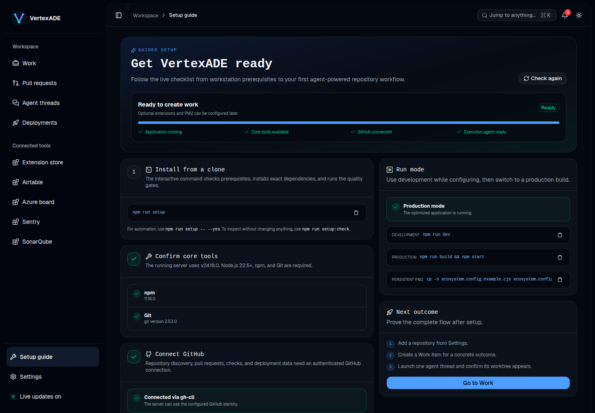

# Guided installation

VertexADE is a self-hosted Node.js application. The guided path has two parts:

1. `pnpm setup` prepares and validates the cloned repository.
2. `/setup` validates the running application and guides connection setup.

## Recommended tool bootstrap with mise

[mise](https://mise.jdx.dev/getting-started.html) is the recommended version manager. The checked-in `mise.toml` pins compatible Node.js and pnpm versions, so a new workstation can reproduce the same toolchain:

```bash
git clone git@github.com:VertexADE/vertexade.git
cd vertexade
mise trust
mise install
pnpm setup
```

`mise trust` is intentionally explicit because repository configuration can affect the local shell. Manual installation remains fully supported.

## Prerequisites

| Requirement                     | Why it is needed                                            |
| ------------------------------- | ----------------------------------------------------------- |
| mise (recommended)              | Install the repository-pinned Node.js and pnpm versions     |
| Node.js 22.13 or newer and pnpm | Run the server, frontend, ESLint 10, installer, and build   |
| Git                             | Clone repositories and create isolated worktrees            |
| GitHub CLI or a GitHub App      | Read repositories, pull requests, checks, and deployments   |
| Codex, OpenCode, or Claude Code | Execute at least one agent workflow                         |
| PM2 (optional)                  | Keep production processes running after the terminal closes |

The installer reports missing optional tools without installing global software or starting authentication on its own.

## 1. Clone and prepare

From the cloned repository:

```bash
pnpm setup
```

Accepting the recommended choices runs:

```text
pnpm install --frozen-lockfile
pnpm check
pnpm test
pnpm build
```

Use a read-only prerequisite check when diagnosing another workstation:

```bash
pnpm setup:check
```

For automation or provisioning:

```bash
pnpm setup --yes
pnpm --silent setup --json
```

`--yes` installs exact lockfile dependencies and runs every quality gate. It does not authenticate GitHub or an agent and does not start PM2.

## 2. Start the application

For local development with hot reload:

```bash
pnpm dev
```

For a foreground production process:

```bash
pnpm build
pnpm start
```

For a persistent PM2 installation, use the verified deployment workflow:

```bash
cp -n ecosystem.config.example.cjs ecosystem.config.cjs
pnpm deploy:verified
```

It requires a clean commit, runs lint and both TypeScript checks, the full test
suite, and the production build before reloading PM2. It then waits for the live
readiness endpoint, saves the PM2 process list, and records the verified
commit in `data/deployment.json`. A failed live probe leaves diagnostic details
in `data/deployment-failure.json` and exits unsuccessfully.

## Verified backups

Create a consistent SQLite snapshot together with the encryption key required
to read stored extension settings:

```bash
pnpm backup
```

The backup includes canonical extension-owned configuration. Upgrade-time extension migrations run once before registration and are recorded in SQLite. Airtable mappings, SonarQube project selection, ACP harnesses, and agent environments are rewritten to their current shapes; obsolete source keys are removed after a successful copy. Keep both the database and `settings.key` so encrypted values remain usable after restore.

Backups are owner-only directories below `backups/` by default. Each contains
SHA-256 checksums and is accepted only after SQLite reports a successful
integrity check. Recheck an existing backup without changing application state:

```bash
pnpm backup:verify --verify backups/<timestamp>
```

Every new backup also runs a non-destructive restore drill against a temporary
copy. Run that drill independently with:

```bash
pnpm backup:restore-drill --restore-drill backups/<timestamp>
```

The drill copies both files into an owner-only temporary directory, opens the
database through the real migration layer, validates SQLite integrity and the
current schema, and decrypts every encrypted setting with the restored key. A
missing, malformed, or mismatched key fails the drill. It does not start jobs,
automations, provider sessions, or previews from the restored snapshot.

For an actual recovery, stop the API first, run the restore drill against the
chosen backup, preserve the current `data/` directory as a rollback copy, then
copy `dashboard.sqlite` and the manifest-named settings key into `data/` with
directory mode `0700` and file mode `0600`. Start the API only after the drill
passes, then verify `/api/health/ready` and representative Work, extension, and
settings reads. Never run a restored snapshot alongside the original against
the same provider sessions or worktrees.

Successful backup creation retains the newest 30 verified backup directories
by default. Set `VERTEXADE_BACKUP_RETENTION_COUNT` to an integer from 1 to
10,000 to change that limit. Pruning only considers timestamp-named directories
containing a manifest and never runs until the new backup and restore drill
both pass.

Store verified backup directories outside the application host as part of the
production backup policy. Treat the copied settings key as a secret.

The default frontend is <http://localhost:4173>. The API listens on `127.0.0.1:4174` and remains available through the frontend's same-origin `/api` proxy.

## 3. Finish setup in the app

Open <http://localhost:4173/setup>. The live guide verifies:

- required Node, pnpm, and Git tooling;
- GitHub CLI or GitHub App authentication;
- runnable Codex, OpenCode, and Claude Code CLIs;
- bundled extension lifecycle state;
- development versus production mode.

The guide links directly to the Extension store for GitHub and optional integration configuration. Only one execution agent is required.



The same checklist reflows into a single-column layout for phones and narrow browser windows: [view the mobile setup guide](screenshots/setup-guide-mobile.png).

## 4. Prove the complete flow

1. Add a repository under Settings.
2. Create a Work item for a concrete engineering outcome.
3. Launch one agent thread.
4. Confirm that its branch, worktree, thread, and output appear under the same Work item.

This verifies more than process health: it proves GitHub access, repository cloning, agent authentication, filesystem permissions, and durable application state together.

## Persistent production hosting

After a successful production build:

```bash
cp -n ecosystem.config.example.cjs ecosystem.config.cjs
pm2 start ecosystem.config.cjs
pm2 save
```

Back up both `data/dashboard.sqlite` and `data/settings.key`. The database contains durable Work and thread state, while the key is required to decrypt extension and agent settings.

Relevant runtime overrides include `HOST`, `PORT`, `API_HOST`, `API_PORT`, `VERTEXADE_API_URL`, `VERTEXADE_API_URLS`, `SETTINGS_KEY_PATH`, and `AGENT_PROVIDER`. Use **Settings → Servers** to link, label, enable, disable, or remove additional public VertexADE servers without frontend environment configuration. Before saving a link, the API uses its DNS-pinning outbound policy to reject loopback, private, link-local, metadata, mixed-address, and redirect-based destinations, then requires a compatible VertexADE read-model identity response. `VERTEXADE_API_URLS` remains available for static operator-managed federation and accepts a JSON array such as `[{"id":"local","label":"Local","url":"http://127.0.0.1:4174"},{"id":"team","label":"Team","url":"https://vertexade-api.internal"}]`.

The application header selects the active server for non-entity capabilities, including settings, extensions, health, automations, search, and deployments. Each server keeps those values independently. The federated read model still combines Work and pull-request data, while explicit backend paths and namespaced entity identifiers take precedence over the active selection. The New Work dialog can choose a different server and limits repository choices to that owner. Title generation, available agents/models, skills, MCP resources, references, thread launch, and contextual extension actions use the same backend. Existing PR, Work, thread, notification, cleanup, and resource mutations continue routing from their namespaced owner identifiers. Keep ids and assigned namespaces stable. A temporarily unavailable server remains visible with its last successful cached projection.

The selected server's web and API bindings can be saved under **Settings → Servers → Network listeners**. The settings are written to `server-runtime.json` in the VertexADE data directory and the bundled `vertexade` launcher applies them on its next restart. `VERTEXADE_SERVER_CONFIG_PATH` may point the launcher at a different file. Explicit `HOST`, `PORT`, `API_HOST`, and `API_PORT` values override the saved file and are identified as environment-owned in the UI. Keep the API listener on loopback when the web process is the same-origin proxy. Any non-loopback listener requires deployment-owned authentication, firewall rules, TLS, and CORS policy; changing a bind address is not itself an access-control mechanism.

GitHub deployment targets are managed under **Extensions → GitHub** on each selected server. Each target defines a stable id and label, repository, workflow, branch, event filter, seed services, ordered environment ids, comparison environment, production environment, and job-name template. `{service}` and `{environment}` identify the captured values, while `{*}` safely matches variable text. Up to 20 targets can be retained, independently enabled, displayed together, filtered, and rerun against the correct repository. `DEPLOYMENT_REPOSITORY`, `DEPLOYMENT_WORKFLOW`, `DEPLOYMENT_BRANCH`, `DEPLOYMENT_EVENT`, `DEPLOYMENT_SERVICES`, `DEPLOYMENT_ENVIRONMENTS`, `DEPLOYMENT_COMPARISON_ENVIRONMENT`, `DEPLOYMENT_PRODUCTION_ENVIRONMENT`, and `DEPLOYMENT_JOB_NAME_TEMPLATE` remain backward-compatible defaults when no targets have been saved.

During a path migration, `VERTEXADE_LEGACY_LOG_ROOTS` may contain a comma-separated list of trusted historical dashboard log directories. Permanent cleanup will copy only regular files contained by those roots into the canonical log directory, verify their SHA-256 digest, durably retarget ownership, and then delete them. Paths outside both the canonical and explicitly allowlisted roots remain blocked for user remediation. Administrators can also set the path-delimited `VERTEXADE_EXTENSION_DIRS` to trusted directories containing local extension packages; bundled extensions keep precedence when ids collide. `DASHBOARD_API_URL` remains available as an older deployment alias. When using PM2, apply host-specific values in a deployment-owned ecosystem file or environment configuration rather than committing workstation credentials.

Cross-origin browser access is denied by default. Set
`VERTEXADE_CORS_ALLOW_ORIGINS` to a comma-separated list of exact HTTP(S)
origins only when the frontend cannot use the same-origin API proxy. Wildcards,
paths, queries, and credentials are rejected. Native clients and same-origin
requests do not send an `Origin` header and need no CORS entry; this behavior is
not an authentication boundary.

Configurable Sentry and SonarQube destinations may reach public addresses by
default. A private self-hosted service must be named as an exact origin in
`VERTEXADE_OUTBOUND_ALLOW_ORIGINS`, for example
`http://sonarqube.internal:9000`. Every DNS result and redirect is still
validated and pinned, and credentials cannot follow a cross-origin redirect.
There is intentionally no blanket private-network switch.

Event streams default to 64 total connections, four per transport IP, a 256
KiB queue per connection, a 64 KiB event limit, and a 25 second heartbeat.
Deployments may lower these with `VERTEXADE_SSE_MAX_CONNECTIONS`,
`VERTEXADE_SSE_MAX_CONNECTIONS_PER_IP`, `VERTEXADE_SSE_MAX_QUEUE_BYTES`,
`VERTEXADE_SSE_MAX_EVENT_BYTES`, and `VERTEXADE_SSE_HEARTBEAT_MS`. The Node
response write deadline defaults to 15 seconds and can be changed with
`VERTEXADE_HTTP_WRITE_TIMEOUT_MS`. Invalid or unbounded values fail startup.

## Expo host

Web and Expo render the same portable workspace and settings declarations. Start Expo with a device-reachable API:

```bash
EXPO_PUBLIC_VERTEXADE_URL=http://192.168.1.10:4174 pnpm dev:mobile
```

Use `10.0.2.2` for the Android emulator and `localhost` for an iOS simulator on the API host. Settings-only and disabled-but-installed extensions remain configurable in the mobile catalog. Secret fields are write-only and are encrypted by the extension backend.

The current API does not yet expose a production mobile authentication boundary. Do not expose it to an untrusted network or distribute a production app until authenticated sessions, authorization enforcement, secure device session-token storage, TLS, and restrictive network policy are in place.

## Troubleshooting

- If `pnpm setup` reports an old Node version, upgrade Node before running `pnpm install --frozen-lockfile`.
- If GitHub is unavailable, run `gh auth status` and `gh auth login`, or configure the GitHub App from the Extension store.
- If an agent is detected but cannot launch, authenticate that CLI once in a terminal and rerun the live check.
- If the build succeeds but PM2 serves missing assets, restart PM2 only after the build has completely finished.
- If the UI loads but repository work fails, use `/setup` to separate GitHub and agent readiness from frontend availability.
