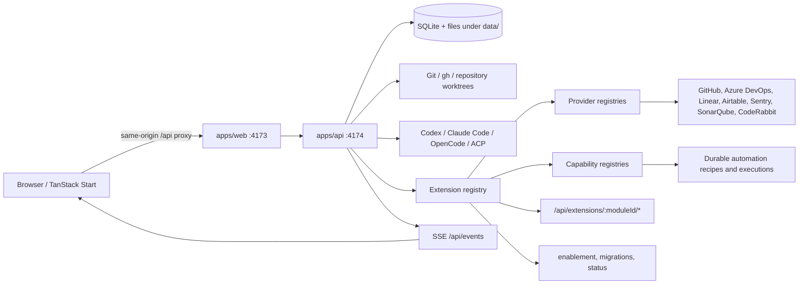

# Repository architecture, extension authoring, and mobile direction

Status: as-built assessment and target-architecture proposal

Snapshot reviewed: 2026-07-25, from commit `e881aae`

Scope: repository structure, build/runtime flow, extension platform, and readiness for an Expo mobile client

## Executive summary

VertexADE is already more than a dashboard with a collection of integrations. Its strongest architectural asset is a real server-side extension kernel:

- extension discovery is convention-based;
- manifests define identity, catalog metadata, permissions, providers, agents, capabilities, UI contributions, and lifecycle hooks;
- host services are scoped and permission-checked;
- provider and capability registries retain module ownership;
- extension routes are namespaced;
- enablement and migrations are durable;
- failed extensions are isolated from the rest of discovery;
- Work is a provider-neutral coordination model shared by integrations and agent runtimes.

That is the right foundation for both a browser host and a future mobile host.

The system is not mobile-ready yet. The largest blockers are not React Native components:

1. The general API, extension APIs, event stream, settings, and mutations do not have a complete user/device authentication and authorization boundary. The API listens on `0.0.0.0` and currently returns wildcard CORS headers. Only the legacy `POST /api/tasks` integration endpoint checks the configured bearer token.
2. The extension frontend contract is DOM-specific. It mounts into an `HTMLElement`, loads React web modules, and supplies browser navigation and `RequestInit`. Expo cannot mount those frontends.
3. API payload types are manually maintained and exposed through many ad hoc endpoints. There is no versioned public API, generated client, consistent error envelope, pagination contract, or offline synchronization protocol.
4. The production build only builds the web host. The API and bundled server extensions run TypeScript source through `tsx`; extensions are discovered from source directories rather than built, versioned artifacts.
5. Several large files concentrate too many responsibilities: `apps/api/src/dashboard-server.ts`, `packages/platform-contracts/src/index.ts`, the Azure DevOps board, and a number of route components.

The recommended direction is to keep extensions server-first and introduce three portable presentation levels:

1. **Headless by default:** providers, capabilities, resources, actions, search, inbox, and events work on every client through the public API.
2. **Declarative surfaces:** an extension may publish list, detail, form, and action schemas that web and Expo render with their own native component kits.
3. **Bundled rich surfaces:** an extension may optionally ship separate `web` and `native` implementations. Native implementations are compiled into an app release and are not assumed to be remotely loadable.

This avoids trying to share DOM components with React Native while still allowing every extension to provide useful mobile behavior.

## 1. As-built system map

### 1.1 Runtime topology



Development and production both use two processes:

- `apps/web` serves the TanStack Start application on port `4173`.
- `apps/api` serves the API on port `4174`.
- `apps/web/src/routes/api.$.ts` proxies `/api/*` to the API, keeping the browser contract same-origin.
- PM2 runs the two processes separately through `ecosystem.config.cjs`.

The API process is the operational center. It owns SQLite, extension loading, worktree and agent process orchestration, provider selection, synchronization, automation, notifications, previews, and the event stream.

### 1.2 Repository structure

```text
.
├── apps/
│   ├── api/
│   │   ├── src/dashboard-server.ts
│   │   └── src/server/
│   │       ├── agents/              agent registry, resources, steering, thread context
│   │       ├── database/            SQLite base schema and application migrations
│   │       ├── events/              dashboard server-sent events
│   │       ├── extensions/          discovery, registry, host permissions, cache
│   │       ├── notifications/       durable notification service and routes
│   │       ├── platform/            providers, capabilities, catalog, workspace APIs
│   │       ├── previews/            container detection, runtime, and gateway
│   │       ├── prompts/             prompt security boundaries
│   │       ├── settings/            encrypted and ordinary settings
│   │       ├── work/                Work domain, memory, cleanup, HTTP, ownership
│   │       └── workflows/           automations, capability execution, job lifecycle
│   └── web/
│       ├── public/                  host branding and static assets
│       └── src/
│           ├── routes/              TanStack Router application surfaces
│           ├── lib/                 web-host utilities
│           └── styles.css           global Tailwind theme
├── packages/
│   ├── platform-contracts/          public types and runtime manifest validation
│   ├── platform-extension-sdk/      extension authoring helpers and conformance checks
│   ├── platform-server/             reusable server helpers for extensions
│   ├── ui/                          web UI kit, shared dashboard views, web module host
│   └── extensions/
│       ├── acp/
│       ├── airtable/
│       ├── azure-devops/
│       ├── claude-code/
│       ├── coderabbit/
│       ├── codex/
│       ├── container-preview/
│       ├── github/
│       ├── linear/
│       ├── opencode/
│       ├── sentry/
│       └── sonarqube/
├── scripts/
│   ├── create-extension.mjs         server-extension scaffold
│   ├── run-workspaces.mjs           serial workspace script runner
│   ├── typecheck-compat.mjs         TypeScript compatibility gate
│   ├── deploy-verified.mjs          checked build and PM2 deployment
│   ├── backup-verified.mjs          SQLite/key backup and restore drill
│   └── verify-*.mjs                 compiler and bundle checks
├── docs/                            architecture, design, installation, Work
├── design/                          visual studies and implementation evidence
├── data/                            runtime database, keys, logs, memory, uploads
├── ecosystem.config*.cjs            PM2 process definitions
├── package.json                     pnpm workspace and root orchestration
└── tsconfig*.json                   shared and compatibility TypeScript configuration
```

Generated build directories, dependencies, runtime data, test artifacts, and visual evidence are present locally but are not part of the authored source architecture.

### 1.3 Size and concentration

At the reviewed snapshot, authored TypeScript/TSX/MJS is approximately 50,000 lines:

| Area                  | Source files | Approximate lines | Test files |
| --------------------- | -----------: | ----------------: | ---------: |
| `apps/api`            |          125 |            18,358 |         59 |
| `apps/web`            |           22 |             4,186 |          1 |
| `packages/ui`         |          138 |            14,242 |         24 |
| `packages/extensions` |           91 |            10,262 |         23 |
| Platform packages     |           12 |             2,533 |          4 |
| `scripts`             |           11 |               643 |          3 |

The primary concentration points are:

- `apps/api/src/dashboard-server.ts`: about 3,343 lines;
- `packages/extensions/azure-devops/src/web/board.tsx`: about 2,529 lines;
- `packages/platform-contracts/src/index.ts`: about 1,599 lines;
- `packages/ui/src/components/ai-elements/prompt-input.tsx`: about 1,463 lines;
- `packages/ui/src/components/automation-recipes.tsx`: about 1,117 lines.

These are not automatically defects, but they are architectural pressure points because unrelated changes share review, test, ownership, and merge surfaces.

## 2. Application and domain boundaries

### 2.1 Web host

The web application is a TanStack Start shell with route-owned pages and a large shared web UI package.

Primary routes:

- `/` — Focus/overview;
- `/inbox` — combined core and extension attention queue;
- `/work` and `/work/:workKey` — durable outcome board and detail;
- `/pull-requests` — PR synchronization, review, and delivery actions;
- `/threads` — agent runs and follow-ups;
- `/deployments` — deployment state;
- `/automations` — automation recipes and schedules;
- `/extensions` — extension catalog and management;
- `/extensions/:moduleId/*` — extension-owned workspace frontend;
- `/settings` and `/setup` — host and installation configuration.

`packages/ui` currently combines four concerns:

- reusable design-system primitives;
- product-specific dashboard components;
- browser-only infrastructure such as `EventSource`, `localStorage`, and Module Federation;
- extension web helpers and shared extension boards.

That combination is convenient for the current web app but is too broad to become a shared web/native package.

### 2.2 API host

`apps/api/src/dashboard-server.ts` composes most of the runtime. It initializes storage and settings, loads extensions, registers core capabilities and automation, starts provider synchronization, launches agents, and contains many legacy route handlers.

Newer subsystems are already extracted into focused modules:

- platform management, workspace, capability, and automation routes;
- Work HTTP and domain services;
- notification routes;
- settings stores;
- agent resources and live control;
- preview detection/runtime/gateway;
- job lifecycle and follow-up queue.

The desired end state is for `dashboard-server.ts` to become a composition root rather than also acting as a controller, repository, orchestration service, and compatibility layer.

### 2.3 Work domain

Work is the main unifying domain:

- `work_items` represents outcomes rather than execution attempts;
- `jobs` are agent executions linked to Work;
- `work_resources` stores provider-neutral identities;
- `work_item_resources` assigns resource roles;
- `work_item_relations` models dependencies;
- `work_events` provides local activity/audit history;
- `work_context_transfers` records cross-worktree handoffs;
- file-backed Work memory shares context across agents and worktrees.

This model should remain the center of a mobile app. Mobile should not invent a second task model or mirror vendor-specific boards. Extension resources should appear as typed resources attached to Work, and extension actions should create or update Work through the existing host services.

One implementation inconsistency should be removed: the base database uses ordered `schema_migrations`, while `WorkService.initialize()` creates and alters its own tables. All durable schema changes should use one migration owner and one transaction model.

### 2.4 Persistence and runtime files

SQLite owns:

- repositories and pull requests;
- jobs, reviews, follow-up queue, and automatic review queue;
- Work and resources;
- extension settings, enablement, and extension migration history;
- automation recipes, runs, capability attempts, audit, and runtime control;
- schedules, notifications, inbox triage, previews, and UI preferences.

The filesystem owns:

- the encryption key;
- logs;
- prompt images;
- Work memory;
- deployment verification records;
- repository clones and provider-owned worktrees outside the repository.

The backup workflow correctly treats the SQLite database and encryption key as a pair. A mobile/API deployment model will also need explicit attachment and Work-memory backup/retention policies.

## 3. Extension platform: how it works

### 3.1 Discovery and activation

Bundled extensions are discovered from:

```text
packages/extensions/<module-id>/src/server/extension.ts
```

Additional trusted roots can be configured through the path-delimited `VERTEXADE_EXTENSION_DIRS` environment variable. Those roots use the same directory convention.

Startup proceeds in phases:

1. Enumerate extension entrypoints.
2. Dynamically import each TypeScript module.
3. Call its optional `createExtension(scopedContext)` factory or use its default export.
4. Validate that the directory id and manifest id match.
5. Validate the manifest and record installation metadata.
6. Run unapplied extension migrations.
7. Load the declared icon asset.
8. Resolve declared extension-part dependencies.
9. Register providers, agents, routes, capabilities, and primitives.
10. Verify that declarations exactly match runtime registrations.
11. Initialize enabled extensions.
12. Publish catalog state and diagnostics.

Bundled extensions take precedence over same-id local extensions. Enablement is persisted in encrypted settings. Extension migrations are recorded in `extension_migrations`.

### 3.2 Public contracts

`@vertexade/platform-contracts` contains:

- platform and design-system API versions;
- manifests, catalog metadata, requirements, permissions, and status;
- extension lifecycle and registration hooks;
- agents and agent resources;
- built-in and custom provider contracts;
- query, transform, action, gate, evidence, trigger, and custom primitives;
- automation and contextual-action contributions;
- extension routes;
- Work resources, relations, memory, and task services;
- web micro-frontend and settings mount contracts.

`@vertexade/platform-extension-sdk` adds authoring helpers:

- `defineManifest`;
- `defineAction`, `defineQuery`, `defineTransform`, `defineGate`, and `defineEvidence`;
- `definePrimitive` and `defineCustomCapability`;
- `defineDesignSystem`;
- `createTrigger`;
- `objectSchema`;
- `extensionConformance`.

`@vertexade/platform-server` provides reusable server helpers for HTTP input, routing, prompts, agent settings, findings APIs, and cache-backed refresh triggers.

### 3.3 Security boundary

An extension declares permissions such as:

- `settings.read` and `settings.write`;
- `repositories.read`;
- `tasks.launch`, `tasks.follow-up`, and `tasks.plan`;
- `work.read` and `work.write`;
- `events.emit`;
- `cache.read` and `cache.write`;
- `scm-auth.manage`;
- `process.execute`.

The scoped factory context checks those permissions before calls into host services. Settings are automatically namespaced as `extension:<module-id>:<key>`.

This is a useful application boundary, not an operating-system sandbox. Server extensions execute inside the API process and can import Node APIs or third-party packages. `VERTEXADE_EXTENSION_DIRS` must therefore remain an administrator-trusted code mechanism until extensions are isolated in workers/processes or a stronger sandbox.

### 3.4 Providers and capabilities

Providers expose a durable integration aspect:

| Provider kind     | Purpose                                | Current implementations                    |
| ----------------- | -------------------------------------- | ------------------------------------------ |
| `scm`             | repository and PR operations           | GitHub                                     |
| `deployment`      | environments, history, reruns          | GitHub Actions                             |
| `work-management` | external planning clients              | Azure DevOps, Linear                       |
| `records`         | record-oriented sources                | Airtable                                   |
| `findings`        | normalized quality/operations findings | CodeRabbit, Sentry, SonarQube              |
| `work-reference`  | attachable external work               | Airtable, Azure DevOps, CodeRabbit, Linear |
| `inbox`           | attention items                        | CodeRabbit, Sentry, SonarQube              |
| `search`          | global search results                  | CodeRabbit, Sentry, SonarQube              |

Custom provider kinds are allowed, but only host or extension workflows that understand their contract can consume them.

Capabilities are executable operations:

- queries retrieve;
- transforms normalize;
- actions mutate or launch;
- gates decide;
- evidence collectors gather proof;
- triggers start automations;
- extension-defined primitives add new executable kinds.

The capability execution service validates schemas, persists attempts, applies timeouts/retries, supports cancellation/idempotency, and emits operational events. This is the best existing abstraction for generic mobile extension actions.

### 3.5 Routes

Extensions register relative routes such as `/settings` or `/findings/:id`. The host publishes them below:

```text
/api/extensions/<module-id>/*
```

Operational routes require the extension to be enabled. Routes marked `availability: "installed"` remain available for configuration while the extension is disabled. Duplicate routes, traversal, malformed parameters, and invalid timeouts are rejected.

The route namespace is strong. The client contract is not: route request and response bodies are mostly extension-specific and are not currently described in the public manifest, OpenAPI, or a generated client.

### 3.6 Web frontends

Bundled web frontends use:

```text
src/web/module.tsx
src/web/settings-module.tsx
```

The web host discovers them at build time with `import.meta.glob`. The extension manifest points to `builtin:<module-id>`. Remote frontends use a same-origin Module Federation manifest.

The workspace frontend mount receives:

- a target `HTMLElement`;
- module identity and route information;
- namespace-scoped `request` and `resolve` functions;
- host navigation;
- a versioned web design-system runtime.

This creates useful error and route isolation for the browser. It is explicitly a web contract because it depends on the DOM, browser fetch types, and web navigation.

### 3.7 Current extension inventory

| Extension          | Server contributions                                                             | Web contributions   |
| ------------------ | -------------------------------------------------------------------------------- | ------------------- |
| ACP                | dynamic ACP agents, settings and registry routes                                 | settings            |
| Airtable           | records and work-reference providers, record APIs, task launch                   | workspace, settings |
| Azure DevOps       | work-management and work-reference providers, trigger, planning/task APIs        | workspace, settings |
| Claude Code        | execution agent and encrypted launch environment                                 | settings            |
| CodeRabbit         | findings, work-reference, inbox, search, remediation action                      | workspace, settings |
| Codex              | execution agent, thread control, timeline normalization                          | settings            |
| Container previews | preview settings and job lifecycle routes                                        | none                |
| GitHub             | SCM and deployment providers, review actions, deployment trigger, authentication | settings            |
| Linear             | work-management and work-reference providers, refresh trigger                    | workspace, settings |
| OpenCode           | execution agent, thread reconciliation, bundled quality skill                    | settings            |
| Sentry             | findings, inbox, search, remediation action                                      | workspace, settings |
| SonarQube          | findings, inbox, search, remediation action                                      | workspace, settings |

The inventory demonstrates that agent runtimes and vendor integrations already fit one lifecycle. That unification should be preserved.

## 4. How to create and build an extension today

### 4.1 Scaffold

From the repository root:

```bash
pnpm create:extension --example-module "Example module"
```

This creates:

```text
packages/extensions/example-module/
├── package.json
├── tsconfig.json
└── src/server/extension.ts
```

The generated package is strict, depends on the contracts and SDK, exports its server entrypoint, and includes workspace `check` and `test` scripts.

The scaffold is server-only. Workspace UI, settings UI, icon, tests, web TypeScript configuration, client helpers, and documentation must be added manually.

### 4.2 Recommended extension layout

For a full bundled integration:

```text
packages/extensions/example-module/
├── assets/
│   └── icon.svg
├── src/
│   ├── server/
│   │   ├── client.ts
│   │   ├── client.test.ts
│   │   ├── api.ts
│   │   └── extension.ts
│   ├── shared/
│   │   ├── schemas.ts
│   │   └── types.ts
│   └── web/
│       ├── module.tsx
│       ├── board.tsx
│       ├── settings-module.tsx
│       └── settings.tsx
├── package.json
├── tsconfig.json
└── tsconfig.web.json
```

Keep vendor credentials and clients under `server`. `shared` must not import Node or DOM APIs. Web modules should call only namespace-scoped extension APIs and must not receive vendor credentials.

### 4.3 Define the manifest

Every manifest needs:

- kebab-case `id`;
- display `name`;
- semantic `version`;
- exact `platformApi`;
- module `kind`.

A production-quality integration should also declare:

- catalog publisher, category, icon, tags, links, and highlights;
- exact host permissions;
- providers, agents, capabilities, and UI contributions;
- optional setup checks;
- optional extension-part and platform-feature requirements;
- optional workspace and settings frontends.

Declarations are not descriptive only. The registry compares declared providers, agents, primitives, and executable capabilities with what `register()` actually supplies.

### 4.4 Choose the extension shape

Use a default export when no host service is needed while constructing the extension:

```ts
export default {
  manifest,
  register({ queries }) {
    queries.register(query)
  },
} satisfies DashboardExtension
```

Use `createExtension(context)` when the extension needs scoped host services, the repository root, or the command runner:

```ts
export async function createExtension(context: ExtensionRuntimeContext) {
  const host = context.host
  if (!host) throw new Error('Host services are required')

  return {
    manifest,
    register({ routes }) {
      routes.register({
        method: 'GET',
        path: '/status',
        handler: () => Response.json({ ok: true }),
      })
    },
  } satisfies DashboardExtension
}
```

Declare every host operation before using it. Prefer providers and capabilities for reusable behavior; use routes for extension-specific HTTP resources and settings.

### 4.5 Add a provider

Use a built-in provider contract when the integration implements a known aspect:

```ts
manifest: {
  // ...
  providers: [{ id: 'example', name: 'Example', kind: 'findings' }],
},
register({ providers }) {
  providers.findings.register(exampleFindingsProvider)
}
```

Use a custom kind only when the contract is genuinely different:

```ts
providers.register('incident-management', incidentProvider)
```

Custom providers do not automatically gain a host screen or workflow. Add a capability, declarative UI contribution, workspace frontend, or consuming extension.

### 4.6 Add executable behavior

Define input and output schemas for capabilities that will be automated or presented generically:

```ts
const acknowledge = defineAction({
  id: 'example.acknowledge',
  name: 'Acknowledge item',
  inputSchema: objectSchema(
    {
      itemId: { type: 'string' },
    },
    ['itemId'],
  ),
  outputSchema: objectSchema(
    {
      acknowledged: { type: 'boolean' },
    },
    ['acknowledged'],
  ),
  execute: async ({ itemId }) => ({ acknowledged: await client.acknowledge(itemId) }),
})
```

Declare the same id under `manifest.contributes.actions`, then register it. Add contextual-action metadata when it should appear against Work, PR, run, finding, deployment, notification, or command-palette entities.

### 4.7 Add routes and settings

Keep settings routes available while disabled:

```ts
routes.register({
  method: 'GET',
  path: '/settings',
  availability: 'installed',
  handler: () => Response.json(publicConfiguration()),
})
```

Settings responses must never return stored secrets. Return presence flags, redacted identity, and verified connection state instead.

Validate:

- bounded request bodies;
- JSON shape and allowed values;
- route parameters;
- upstream URLs;
- timeouts and abort signals;
- normalized error messages;
- output that may contain untrusted vendor content.

### 4.8 Add a bundled web workspace

Declare:

```ts
frontend: {
  entry: 'builtin:example-module',
  expose: './module',
  routeBase: '/extensions/example-module',
  navigation: {
    to: '/extensions/example-module',
    label: 'Example',
  },
  designSystem: defineDesignSystem('button', 'card', 'section'),
}
```

Export a `MicroFrontendModule` from `src/web/module.tsx`. Mount React into the supplied element, use `createScopedApi(context.request)`, and return a cleanup function. Declare settings independently and export `ModuleSettingsModule` from `settings-module.tsx`.

Add web exports, React/UI dependencies, a `tsconfig.web.json`, and a web check to the extension package. The Vite host includes bundled modules through its compile-time glob.

### 4.9 Validate locally

During development:

```bash
pnpm --filter @vertexade/extension-example-module check
pnpm --filter @vertexade/extension-example-module test
pnpm check
pnpm test
pnpm build
git diff --check
```

Then run the application and verify observable behavior:

```bash
pnpm dev
curl http://127.0.0.1:4174/api/modules
curl http://127.0.0.1:4174/api/capabilities
curl http://127.0.0.1:4174/api/extensions/example-module/status
```

Verify at least:

- the module is discovered;
- its lifecycle and diagnostics are correct;
- declared contributions appear;
- disabling blocks operational routes and providers;
- installed-only settings remain reachable;
- the workspace and settings frontends mount and clean up;
- one real provider response matches the tested contract;
- an extension action produces durable Work/execution evidence.

For a production deployment, use `pnpm deploy:verified`; it runs the repository quality gates, builds into a staging output, activates the completed build, restarts both PM2 processes, verifies their runtime root, probes readiness, saves PM2, and records the deployed commit.

### 4.10 External local extensions

`VERTEXADE_EXTENSION_DIRS` is useful for administrator-owned development and private integrations. It is not yet a marketplace/install mechanism:

- code runs in the API process;
- dependencies and TypeScript execution rely on the host runtime;
- only the server entrypoint checksum is published;
- there is no package signature, provenance record, isolation boundary, or compatibility lock;
- local web code is not automatically compiled into the host;
- a remote frontend must be served from the dashboard origin;
- removal and upgrade workflows are not packaged.

Treat those directories like trusted application code.

## 5. What is strong and should be preserved

### 5.1 One lifecycle for agents and integrations

Agents, source control, planning, findings, records, and previews share discovery, enablement, settings, health, and diagnostics. Avoid creating a separate “mobile plugin” registry.

### 5.2 Work as the common outcome model

External issues and findings become resources or launch context for Work. This is more durable than mirroring each vendor into core database columns.

### 5.3 Provider-neutral orchestration

Host workflows resolve providers by aspect and context. Provider-owned SCM terminology already prevents GitHub wording from leaking into the generic domain.

### 5.4 Executable capabilities

Schema-described capabilities with durable execution are a natural cross-client action protocol. They should become a first-class part of the public mobile API.

### 5.5 Scoped settings and routes

Namespaced storage and HTTP routes give every extension a predictable boundary. Preserve those namespaces in any versioned API.

### 5.6 Lifecycle diagnostics

The catalog already provides installed/enabled/configured/healthy/lifecycle/failure state. This can drive web, mobile, setup, and operations without separate logic.

## 6. Improvement backlog

### P0 — required before a real mobile client

#### Add complete API authentication and authorization

Introduce users, sessions/devices, and roles or scopes. At minimum distinguish:

- read Work, PR, run, inbox, and extension catalog;
- launch or steer work;
- execute extension actions;
- mutate upstream SCM/vendor state;
- administer repositories, automations, agents, extensions, and secrets.

Use TLS, short-lived access tokens, revocable refresh/device sessions, secure token storage, rate limits, an origin allowlist for browser access, and audited privileged actions. Preserve a separate narrowly scoped service-token flow for external automation.

#### Publish a versioned API

Create `/api/v1` with:

- stable resource names;
- schemas generated from one source;
- consistent errors;
- pagination and filtering;
- idempotency keys for mutations;
- optimistic concurrency/revisions where needed;
- an OpenAPI document and generated TypeScript client.

Do not make Expo depend directly on raw SQLite-shaped dashboard payloads.

#### Define a resumable event contract

Replace free-form reason strings as the public protocol with a versioned envelope:

```ts
type PlatformEvent = {
  id: string
  type: string
  occurredAt: string
  actor?: string
  entity: { kind: string; id: string; revision?: number }
  moduleId?: string
  payload: unknown
}
```

Support replay from a cursor or `Last-Event-ID`. Mobile background delivery should use push notifications; reconnecting the app should then fetch authoritative state.

### P1 — unify the extension and client platform

#### Split platform contracts by runtime

The current “framework-neutral” package includes `HTMLElement` and browser request types. Split it into:

```text
@vertexade/platform-core-contracts   manifests, entities, schemas, events, actions
@vertexade/platform-server-contracts host services, providers, lifecycle, routes
@vertexade/platform-web-contracts    DOM micro-frontends and web design system
@vertexade/platform-native-contracts native surface contracts
```

Compatibility exports can preserve the current package during migration.

#### Add a platform client package

`@vertexade/platform-client` should own:

- base URL and authentication;
- generated endpoint types;
- normalized errors;
- retry and idempotency behavior;
- event subscription/replay;
- extension-scoped clients;
- cache keys and entity revision handling.

Both web and Expo should use it.

#### Add declarative extension surfaces

Define a constrained schema for:

- navigation entries;
- collection queries;
- list/card fields;
- detail sections;
- filters;
- forms;
- badges/status;
- commands and contextual actions;
- empty/loading/error states.

Each host maps those semantics to its own accessible component kit. Declarative surfaces should be deliberately less powerful than custom UI and more portable.

#### Make capability schemas discoverable

Expose safe, enabled capability metadata through the public API. A generic host should be able to render an action form from the schema, show confirmation requirements, execute with an idempotency key, and follow the durable result.

### P1 — reduce server coupling

#### Turn `dashboard-server.ts` into a composition root

Extract:

- repository/PR synchronization;
- route controllers;
- agent launch orchestration;
- review workflows;
- scheduled jobs;
- SCM actions;
- legacy compatibility endpoints.

Each module should depend on explicit services instead of file-level state.

#### Use one database migration system

Move Work table creation and ad hoc column changes into the ordered database migration registry. Add schema snapshot and migration-upgrade tests.

#### Introduce repositories for persistence

Domain services should not issue unrelated SQL directly. Small typed repositories will make API versioning, event emission, authorization, and future multi-user scoping safer.

### P2 — make extensions distributable

#### Build server artifacts

Compile the API and extension server packages. Load explicit package exports from built artifacts instead of TypeScript source. Produce a deployment manifest containing:

- module id and version;
- platform API compatibility;
- full artifact hashes;
- dependency lock/provenance;
- migrations;
- declared permissions and network/process needs;
- frontend/native surfaces.

#### Isolate untrusted extension execution

For anything beyond administrator-trusted local code, run server extensions in worker threads or supervised child processes with an RPC host contract, time/memory limits, explicit environment, and controlled filesystem/network access.

Host-service permission proxies alone cannot constrain arbitrary Node code.

#### Expand the scaffold and conformance kit

The generator should offer:

- server-only, integration, agent, and full-surface templates;
- shared schemas;
- icon and catalog placeholders;
- web and native entrypoints;
- route/capability/provider examples;
- lifecycle, permission, disabled-state, and contract tests;
- README and release metadata.

Add a command such as:

```bash
pnpm extension:verify --example-module
```

It should validate package exports, manifest/version parity, registration drift, API schemas, forbidden imports, icon assets, frontends, native compatibility, and built artifacts.

### P2 — improve frontend boundaries

#### Split web UI from product features

Suggested packages:

```text
@vertexade/design-tokens
@vertexade/ui-web
@vertexade/ui-native
@vertexade/product-view-models
@vertexade/extension-web
@vertexade/extension-native
```

Share tokens, schemas, formatters, and view models. Do not try to share Radix/DOM components with React Native.

#### Break down large screens

Start with the Azure board, automation recipes, PR route, and Work detail route. Extract domain hooks, view models, focused panels, and mutation services before adding mobile equivalents.

### P3 — operations and documentation

- Add an architecture decision record for the extension trust model.
- Add an ADR for portable extension presentation.
- Add API and event compatibility policies.
- Add a real remote frontend example and deployment instructions.
- Remove duplicated or stale README sections.
- Generate the extension inventory and contract tables from manifests.
- Add dependency-boundary linting between apps, platform packages, UI runtimes, and extensions.
- Track extension health latency, capability latency/error rate, event lag, and mobile push delivery.

## 7. Target architecture for Expo

### 7.1 Proposed workspace layout

```text
apps/
  api/
  web/
  mobile/
    app/                       Expo Router routes
    src/
      auth/
      components/
      extensions/
      features/
      notifications/
      storage/
packages/
  platform-core-contracts/
  platform-server-contracts/
  platform-web-contracts/
  platform-native-contracts/
  platform-client/
  extension-ui-schema/
  design-tokens/
  ui-web/
  ui-native/
  product-view-models/
  extensions/
    <id>/
      src/
        shared/
        server/
        web/
        native/                optional rich native renderer
```

[Expo officially supports workspace monorepos](https://docs.expo.dev/guides/monorepos/), so `apps/mobile` fits the existing pnpm workspace structure. [EAS commands and configuration should live and run from the mobile app directory](https://docs.expo.dev/build-reference/build-with-monorepos/). If EAS needs shared packages prepared first, make that an explicit mobile build step rather than relying on the web build.

### 7.2 Portable extension levels

#### Level 1: headless

Every installed extension is mobile-usable when it contributes any of:

- inbox items;
- search results;
- Work references/resources;
- capability actions;
- contextual actions;
- health/setup state;
- notifications;
- automation templates.

The mobile host renders these generically. No native extension code is required.

#### Level 2: declarative

The manifest advertises mobile-capable surface descriptors:

```ts
mobile: {
  navigation: { label: 'Findings', icon: 'shield-alert' },
  surfaces: [{
    id: 'findings',
    kind: 'collection',
    source: { capabilityId: 'example.list-findings' },
    item: {
      title: { path: 'title' },
      subtitle: { path: 'project' },
      status: { path: 'severity' },
    },
    actions: ['example.remediate'],
  }],
}
```

The exact schema needs an ADR and prototype. It must be versioned, validated, bounded, accessibility-aware, and incapable of arbitrary code execution.

#### Level 3: rich native

An extension may export a React Native module for experiences that cannot be expressed declaratively:

```text
@vertexade/extension-example/native
```

The mobile app maintains a compile-time registry generated from installed workspace packages. Rich native modules use the same scoped client and design tokens as declarative surfaces.

Adding or changing native dependencies requires a compatible native runtime/build. [Expo runtime versions](https://docs.expo.dev/eas-update/runtime-versions/) exist specifically to prevent JavaScript updates from running against incompatible native code. Treat extension native code as an app-release concern; headless and declarative contributions remain the path for server-installed extensions to appear without a new binary.

### 7.3 Mobile app responsibilities

The Expo host should own:

- authentication and secure device token storage;
- API client lifecycle and environment selection;
- Expo Router navigation and deep links;
- native design system and accessibility;
- query caching and offline read state;
- event reconnect and cursor handling;
- push registration and notification routing;
- generic extension collection/detail/form/action rendering;
- native error boundaries;
- feature flags and minimum server/API compatibility.

The server should own:

- vendor credentials and API calls;
- extension execution;
- authorization and audit;
- Work and resource truth;
- capability execution;
- event history;
- push notification decisions and delivery queue.

### 7.4 Suggested first mobile vertical slice

Build an operator companion, not a full desktop clone:

1. Sign in and select a VertexADE server.
2. Show Focus/Inbox with extension-provided items.
3. Show Work board and Work detail.
4. Show a run timeline, result, diff summary, and input-required state.
5. Allow safe steer/queue/follow-up actions according to server authorization.
6. Show PR status and provider-owned terminology.
7. Render extension contextual actions generically.
8. Receive a push for input required, failed run, completed review, or approval required.
9. Open the correct Work/run/PR/extension surface from a deep link.

Settings that expose credentials, process execution, repository filesystem paths, extension installation, or destructive cleanup should remain web/admin-only in the first release.

### 7.5 Mobile data and event behavior

- Use server state as authoritative.
- Cache read models for offline inspection.
- Queue only explicitly offline-safe mutations.
- Require idempotency keys for launches and actions.
- Show pending, accepted, running, completed, and failed states from durable executions.
- Resume events from a cursor after foregrounding.
- Fetch entity state after a push instead of trusting the push payload as truth.
- Use platform deep links such as `vertexade://work/W-0042` and universal links where deployed.

[Expo Router supports deep linking from route structure](https://docs.expo.dev/router/basics/navigation/). [Expo Notifications](https://docs.expo.dev/push-notifications/push-notifications-setup/) can use the Expo push service or direct FCM/APNs; the server design should store both device identity and push-provider metadata behind one notification service.

### 7.6 Authentication model

A practical first model:

- server-local user accounts or an OIDC provider;
- authorization code with PKCE for mobile;
- short-lived access token;
- rotated, revocable device refresh session;
- access token held in memory;
- refresh secret in platform secure storage;
- per-action authorization on the API;
- step-up confirmation for destructive or upstream mutations;
- device/session management from the web admin;
- audit records containing actor, device/session, action, target, result, and idempotency key.

Do not reuse the single external automation bearer token as a mobile user session.

## 8. Delivery roadmap

### Phase 0 — decisions and boundaries

Deliver:

- ADR: public API/authentication;
- ADR: event envelope and replay;
- ADR: headless/declarative/rich extension surfaces;
- package-boundary rules;
- threat model for remote/mobile access.

Exit criteria:

- no unresolved decision about identity, tenant scope, extension trust, or mobile surface loading.

### Phase 1 — public API foundation

Deliver:

- `/api/v1`;
- authentication, scopes, and audit;
- OpenAPI and generated `platform-client`;
- stable errors, pagination, idempotency, revisions;
- event persistence and cursor replay.

Exit criteria:

- a CLI client can authenticate, list Work, execute an authorized extension action once, reconnect to events, and prove the audit trail.

### Phase 2 — portable extension contract

Deliver:

- split runtime contracts;
- public module/capability/action discovery;
- declarative surface schema and validators;
- web renderer using the same schema;
- conformance tests and scaffold updates.

Exit criteria:

- one findings extension and one planning extension render and execute from the generic web renderer without extension-specific host code.

### Phase 3 — Expo operator companion

Deliver:

- `apps/mobile`;
- Expo Router, auth, secure session storage, platform client;
- Focus, Work, Work detail, run timeline, PR summary;
- generic extension surface/action renderer;
- push and deep links;
- offline read cache and event resume.

Exit criteria:

- on a real iOS and Android device, an extension finding can launch authorized Work, the run updates live, a background completion push arrives, and the deep link opens the correct result.

### Phase 4 — extension migration and richer mobile UX

Deliver:

- declarative surfaces for Airtable, Azure DevOps, CodeRabbit, Linear, Sentry, and SonarQube;
- generic agent settings/status views where safe;
- optional rich native renderer for one proven need;
- mobile-compatible design tokens and accessibility test matrix.

Exit criteria:

- disabling an extension removes its navigation and actions on both hosts;
- enabling it restores matching catalog, health, resources, and actions;
- no vendor secret reaches a mobile device.

### Phase 5 — distribution and isolation

Deliver:

- built extension artifacts;
- full-package integrity/provenance;
- upgrade/rollback;
- isolated server execution for non-bundled code;
- compatibility telemetry;
- EAS release channels/runtime policy.

Exit criteria:

- an extension can be installed, verified, enabled, upgraded, disabled, and rolled back without rebuilding the API host, while its headless/declarative mobile behavior remains compatible.

## 9. Definition of “mobile-ready extensions”

The platform is mobile-ready when all of the following are observable:

- Every client request is authenticated and authorized.
- API and event versions are explicit and compatibility-tested.
- Extension secrets remain server-side.
- Enabled extension providers and capabilities are discoverable through a generated client.
- At least one extension action is rendered generically on web and native from the same schema.
- Action execution is idempotent, durable, auditable, and reconnectable.
- Disabling an extension removes its operational routes, providers, actions, navigation, and event production from both clients.
- A native client can resume state after backgrounding or loss of connectivity.
- Push notifications deep-link to authoritative server state.
- Rich native extension code is versioned with the app runtime, while server-installed extensions still work headlessly or declaratively.
- Extension conformance tests cover manifest drift, permissions, lifecycle, schemas, UI surfaces, and compatibility.

## 10. Immediate next actions

The detailed execution sequence, per-extension waves, PR-sized backlog, acceptance gates, and rollback strategy are maintained in the [Extension portability migration plan](extension-portability-migration-plan.md).

The highest-value order is:

1. Approve the public API/authentication and portable-surface ADRs.
2. Extract and version one read path (`Work`) and one action path (a safe extension capability).
3. Generate `@vertexade/platform-client` and migrate the web app to those two paths first.
4. Add event ids and replay before building mobile live state.
5. Prototype one declarative findings surface in the web host.
6. Create `apps/mobile` only after those contracts are real.
7. Prove the full Sentry/CodeRabbit finding → Work → agent run → push → deep-link flow on physical devices.

This sequence uses the current extension kernel and Work model instead of rewriting them, while fixing the security and client-contract gaps that would otherwise be multiplied by a mobile app.

## 11. Evidence and limitations

This assessment inspected:

- root workspace, build, setup, backup, deployment, and PM2 configuration;
- application and package manifests;
- repository-authored source topology and concentration;
- public contracts, SDK, server helpers, and manifest validators;
- extension discovery, lifecycle, registry, scoped host services, routes, providers, capabilities, and frontends;
- every bundled extension entrypoint and package surface;
- API composition, database migrations, Work schema, web API proxy, client utilities, and event handling;
- existing architecture, installation, Work, design-system, and product documentation;
- current official Expo monorepo, EAS runtime-version, Router deep-linking, and Notifications guidance.

It did not:

- change application behavior;
- expose the server outside its current environment;
- exercise real external provider credentials;
- install or scaffold Expo;
- make product decisions about identity provider, hosting topology, marketplace trust, or which mobile settings are allowed.

Those decisions should be captured in ADRs before implementation because they materially affect the public contract and security model.
